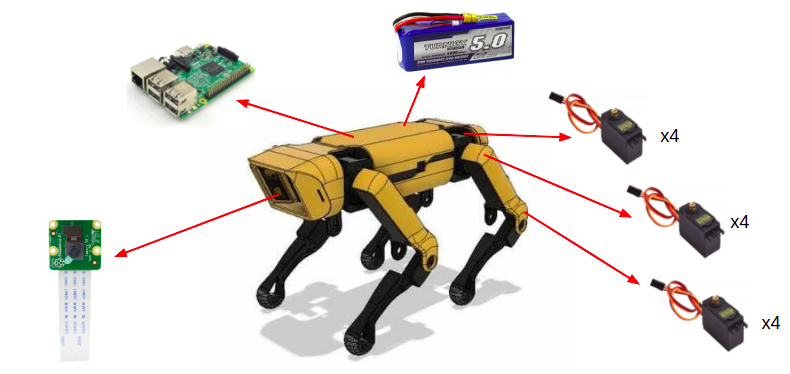
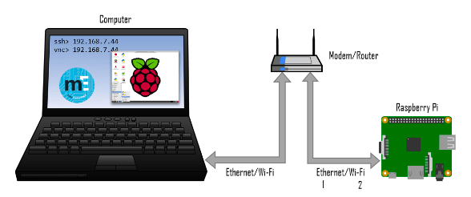
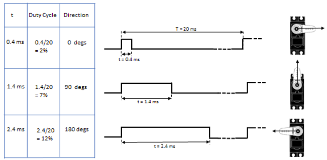
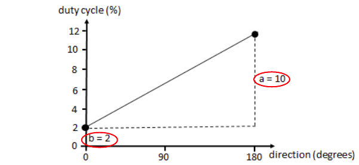
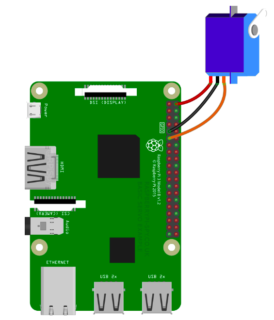
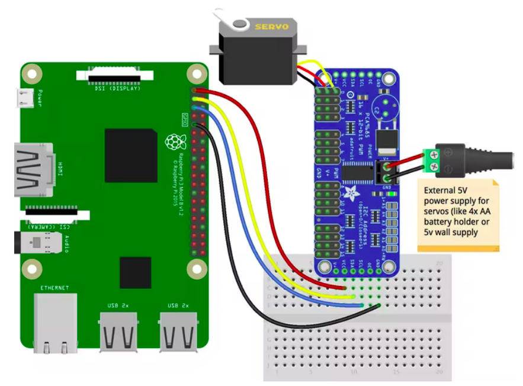

[](https://www.python.org/)
[](https://opensource.org/licenses/mit-license.php)
[](https://github.com/dennishnf/project-microspot-ai/issues)
[](https://github.com/ellerbrock/open-source-badges/)
[](https://twitter.com/intent/tweet?text=Download%20and%20use%20the%20Project%20XR%20Glasses&url=https://github.com/dennishnf/project-microspot-ai&hashtags=robotics,spotmicroai,spotmicro,raspberry)     

# Project-SpotMicro-AI

Calibrating and controlling the MicriSpotAI robot from scratch.


## Components from MicroSpot

The MicriSpotAI has the following main components:

- Raspberry Pi 3B +    
- Raspberry Pi Camera  
- LiPo Batteries    
- Servomotors    

<p align="center">

</p>


## Conection to Raspbperry Pi

To connect to the MicroSpot robot you must use their own hotspot network, but this type of configuration produces that the Raspberry Pi and the laptop does not have internet connection, which is a problem. For this reason we looked for another type of access from a laptop to the Raspberry Pi. So, there are several configurations for the SSH connection, it can be through a LAN cable, or through the local internet network.

Between these two types of SSH connections, the connection via the local WiFi network was chosen because it would be easier to manipulate the robot wireless and remotely.

<p align="center">

</p>


Follow the steps:

1. Open the memory card on your computer

2. Go to folder boot

3. Open the file wpa_supplicant.conf

4. Paste the following and replace the “country”, “ssid” and “psk”

```
ctrl_interface=DIR=/var/run/wpa_supplicant GROUP=netdev
update_config=1
country=«your_ISO-3166-1_two-letter_country_code»

network={
    ssid="«your_SSID»"
    psk="«your_password_PSK»"
    key_mgmt=WPA-PSK
}
```

Open Terminal app on your laptop and type the following command:

```
$ ssh pi@raspberrypi.local
```

Or:

```
$ ssh ubuntu@ubiquityrobot.local
```

**Warning:**

Be careful with some WiFi names or passwords, as the use of characters such as hyphens (-) or quotes (") may cause the password to be misconfigured in wpa_supplicant.conf


## Calibration of the servomotors

The servomotors have the following operation according to duty cycle:

<p align="center">

</p>

For the calibration we need to find the values of ```a``` and ```b```, which are shown below:

<p align="center">

</p>


### Calibration of 1 servomotor via GPIO ports

Code: ```calibration/servo1.py```

First we evaluate the correct operation of the motors, for this we use the simple code mentioned above and the configuration shown in the figure. To control the servomotor we use the GPIO ports of the Raspberry Pi.

<p align="center">

</p>


### Calibration of 1 servomotor via PCA9885 module

Code: ```calibration/servo2.py```

Now a servo is going to be controlled using the PCA9885 module. For this we will use the python file ```calibration/PCA9685.py```. It is recommended to use this file instead of installing the Adafruit CircuitPython PCA9685 library, since this library could generate several conflicts with other libraries.

In addition, since the I2C protocol will be used for communication between the Raspberry Pi and the PCA9685 module, the respective libraries for the use of I2C on the Raspberry Pi must be installed. To do this, install the libraries with: ```sudo apt-get install python-smbus i2c-tools```, and then test the address with the command: ```sudo i2cdetect -y 1-```

Here we manually find the values of ```a``` and ```b```, mentioned at the beginning of this section.

<p align="center">

</p>

### Calibration of 4 servomotor via PCA9885 module

Code: ```calibration/servo3.py```

Finally, to make the use of several motors at the same time using the PCA9685 module, we will place several motors and test their correct operation, since the current source could not be enough to control several servomotors at the same time.

Here we verify that the values of ```a``` and ```b``` found above give a correct synchronous operation of the motors together.

<p align="center">

</p>

**Warning:** 

Be careful when connecting the DATA and CLOCK signals between the PCA9885 module and the Raspberry Pi.


## Demos for test calibration

### Test calibration by moving one joint at a time

Code: ```calibration/moveEachLeg.py```

In this calibration test, the movement of each servomotor is performed according to the assigned movement angles. This test is performed in series, for each servomotor, one after other.

<p align="center">

</p>

### Simulating walk by moving various joints at a time

Code: ```calibration/moveEachLeg.py```

As can be seen, first the motors start in a non-aligned initial position, the calibration program re-aligns the legs and begins to perform a repetitive motion simulating walking.

<p align="center">

</p>

**Warning:** 

Because PCA9885 modules have a maximum output amperage for servomotors, two or three PCA9885 modules should be used. It was observed that when only one PCA9885 module was used, it was not possible to energize all 12 servomotors, so we proceeded to use two PCA9885 modules, each controlling 6 servomotors.


## Collaborators

- Alexander OBEID ([@AlexanderOG](https://github.com/AlexanderOG))    
- Dennis NUNEZ FERNANDEZ ([@dennishnf](https://github.com/dennishnf))    


## Support

- CRI, Université de Paris.     
- Rajeev Mylapalli.


## Resources and references

- [GitHub: Spot Micro Quadruped Project](https://github.com/mike4192/spotMicro)

- [GitLab: Custom version of BostonDynamics Spot robot](https://gitlab.com/public-open-source/spotmicroai/electronics)

- [Python Exemplary: Using servomotors and PCA9685](http://www.python-exemplary.com/index_en.php?inhalt_links=navigation_en.inc.php&inhalt_mitte=raspi/en/servomotors.inc.php)

- [GitHub: SpotMicroAI Repositoty](https://github.com/FlorianWilk/SpotMicroAI)

- [Nova Spot Micro 3 Mini Clone Quadruped Robot Dog](https://www.instructables.com/Nova-Spot-Micro-a-Spot-Mini-Clone/)

- [Official ROS Website](https://www.ros.org/)

- [Official ROS Kinetic Website](http://wiki.ros.org/kinetic)


<!---

git pull
git add -A
git commit -m "v0"
git push -u origin main

--->

